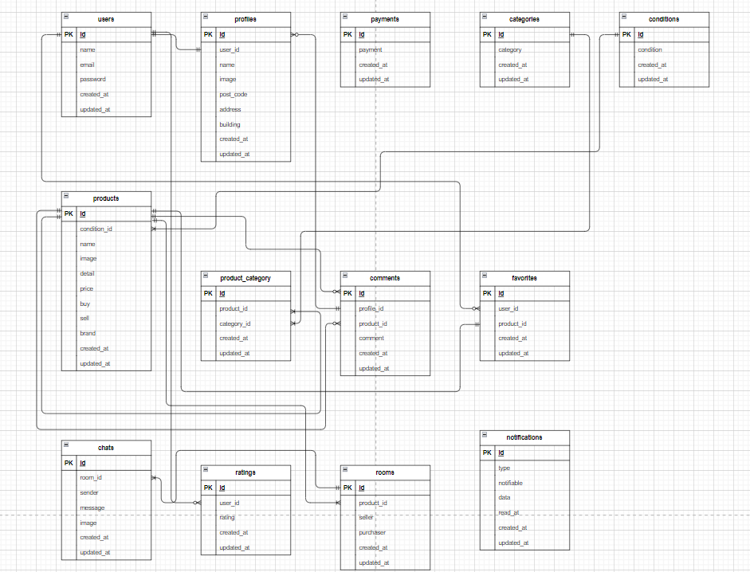

# フリマ

## 環境構築
**gitクローン**
1. `git clone git@github.com:yuu-2-hue/free-market.git`
2. GitHubでリモートリポジトリ作成
3. リポジトリの紐づけ先を変更
    ``` bash
    git remote set-url origin 作成したリポジトリのurl
    git remote -v
    ```
4. 現在のローカルリポジトリのデータをリモートリポジトリに反映
    ``` bash
    git add .
    git commit -m "リモートリポジトリの変更"
    git push origin main
    ```
    エラーが発生する場合は下記コードを実行してください  
    `sudo chmod -R 777 *`

**Dockerビルド**
1. DockerDesktopアプリを立ち上げる
2. `docker-compose up -d --build`

**Laravel環境構築**
1. `docker-compose exec php bash`

2. `composer install`

3. 「.env.example」ファイルを 「.env」ファイルに命名を変更。または、新しく.envファイルを作成

4. .envに以下の環境変数を追加
``` text
DB_CONNECTION=mysql
DB_HOST=mysql
DB_PORT=3306
DB_DATABASE=laravel_db
DB_USERNAME=laravel_user
DB_PASSWORD=laravel_pass
```
5. Mailtrapへログイン  
下記URLよりmailtrapへログイン  
<https://mailtrap.io/signin>
> *会員登録していない場合は登録してください*  

6. .envに追加する情報を取得  

``` text
1. 左のメニューから Email Testing を開く
2. PHP をクリックし、Laravel のバージョンを選ぶ
3. 環境変数をコピーし、Laravel プロジェクトの.env に貼り付ける
4. パスワードをコピーし、.env の該当場所に貼り付ける
```

7. .envに以下環境変数を追加
> XXXXは環境によって異なります。
``` text
MAIL_MAILER=smtp
MAIL_HOST=sandbox.smtp.mailtrap.io
MAIL_PORT=2525
MAIL_USERNAME=XXXX
MAIL_PASSWORD=XXXX
MAIL_ENCRYPTION=tls
MAIL_FROM_ADDRESS=test@example.com
MAIL_FROM_NAME="${APP_NAME}"
```

8. Stripeへログイン  
下記URLよりStripeへログイン  
<https://stripe.com/jp>
> *会員登録していない場合は登録してください*  

9. .envに追加する情報を取得

``` text
1. 実際に決済が実行されないようにテスト環境に設定
2. .env情報をコピーして.envに張り付ける
```

10. .envに以下環境変数を追加
``` text
STRIPE_PUBLIC_KEY="YOUR_PUBLIC_KEY"
STRIPE_SECRET_KEY="YOUR_SECRET_KEY"
```

11. Stripe PHPライブラリのインストール
``` bash
docker-compose exec workspace composer require stripe/stripe-php
```

12. アプリケーションキーの作成
``` bash
php artisan key:generate
```

13. マイグレーションの実行
``` bash
php artisan migrate
```

14. シーディングの実行
``` bash
php artisan db:seed
```
15. シンボリックリンク作成
``` bash
php artisan storage:link
```

### テーブル
https://docs.google.com/spreadsheets/d/1_CKgkV9FN0fwd3D9EIlrZF6fcDTNv2xwgYK6WGo1kfc/edit?usp=sharing

### ユーザーダミーデータ
| 名前 | メールアドレス | パスワード |
| :----: | :----: | :----: |
| 長谷川 | hasegawa@example.com | hasegawa |
| 山本 | yamamoto@example.com | yamamoto |
| 中川 | nakagawa@example.com | nakagawa |

### 使用技術
* PHP 7.4.9
* Laravel 8.0
* MySQL 8.0.26
* Mailtrap
* Stripe

### ER図


### URL
* 開発環境：http://localhost
* phpMyAdmin：http://localhost:8080/
